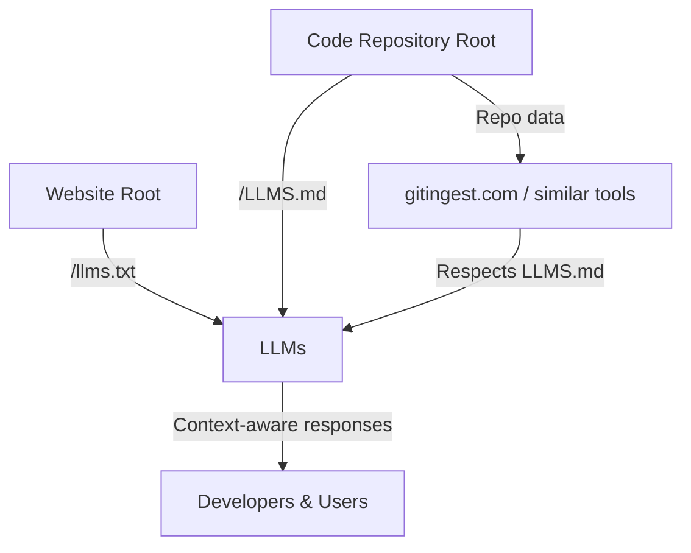

# LLMS.md Specification (v0.1)

> ✨ A lightweight, repo-level convention for guiding Large Language Models (LLMs) — inspired by `README.md` and `llms.txt`.

---

## What is `LLMS.md`?

`LLMS.md` is a proposed open convention for code repositories.  
It gives Large Language Models a **structured, machine-friendly context file** — the same way:

📄 See the live spec in [LLMS.md](./LLMS.md).

📚 For background and rationale, read the full [RFC](./rfc/0001-llms-md-spec.md).

- `README.md` helps **humans** understand a repo.  
- `robots.txt` and `llms.txt` help **web crawlers & LLMs** understand a site.  

With `LLMS.md`, AI tools (Copilot, Cursor, Claude Code, Gemini CLI, etc.) can:
- Quickly find **key directories and entry points**  
- Know which files to **ignore** (build artifacts, dependencies)  
- Learn **how to run and test** the project  
- Follow **reasoning hints** from maintainers  

---

## Why now?

- LLM-powered IDEs and CLIs are exploding — but every tool invents its own config.  
- Developers already rely on standardized repo files (`README.md`, `LICENSE`, `.editorconfig`).  
- We need a **single, community-driven convention** that all agents and tools can adopt.

---

## Goals

- 📖 **Readable** by humans (Markdown format, ≤100 KB)  
- 🤖 **Parseable** by machines (stable section headings)  
- 🔍 **Discoverable** by tools (always in repo root)  
- 🔄 **Portable** across IDEs, CLIs, and agents  

---

### Vision Caption

llms.txt (for websites) and LLMS.md (for repos) are two sides of the same coin: lightweight, root-level files that give LLMs curated context. Services like **gitingest** can consume these specs to produce clean, structured input for models. Together, they reduce noise, improve attribution, and make AI-assisted tools more reliable.

---

## Status

- 🚧 Draft v0.1 — feedback welcome  
- 📂 This repo contains:
  - [The Spec](./LLMS.md)  
  - [Examples](./examples/)  
  - [Validator Script](./scripts/validate-llms.js)  
  - [GitHub Action](.github/workflows/validate.yml)  

---

## Get Started

1. Copy [`LLMS.md`](./LLMS.md) into the root of your repo.  
2. Fill in key sections: directories, entry points, run/test instructions.  
3. (Optional) Add the [validator GitHub Action](./.github/workflows/validate.yml) to keep it fresh.  

---

## Contributing

This is an open standard — we’d love your input!  
- Open an [issue](../../issues) for discussion.  
- Send a PR to improve the spec or examples.  
- Join the conversation on [Discussions](../../discussions).  

---

## License

MIT